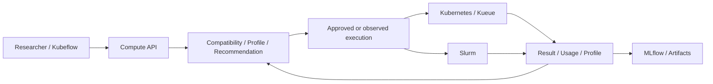

# Resource Advisor

**GPU·NPU 자원을 확인하고, 검증된 AI 작업을 큐에 제출하며, 결과·실험 기록·사용량을 연결하는 연구 플랫폼입니다.**
Kubernetes/Kueue와 Slurm 위에서 실행 가능성 검증과 profile-guided 자원 추천을 담당합니다.
전체 HAIRP 설계와 모든 장비의 자동 right-sizing은 아직 완료되지 않았습니다.

## 처음 읽을 문서

| 내용 | 문서 |
|---|---|
| 어떻게 사용하는가 | [사용법](docs/quickstart-ko.md) |
| 무엇을 직접 만들었는가 | [구성요소와 차별점](docs/platform-explained-ko.md) |
| 어떤 장비에서 실제 실행되는가 | [GPU·NPU 실행 범위](docs/all-accelerators.md) |
| 기존 방식과 비교하면 어떤가 | [비교 결과와 비용](docs/right-sizing-comparison-results.md) |
| 어디까지 기여로 말할 수 있는가 | [연구 기여와 한계](docs/right-sizing-contribution.md) |

구현·장애·복구·실험별 상세 기록은 [문서 목차](docs/README.md)에서 필요한 항목만 펼쳐 보세요.

## 사용 흐름

설정된 API 주소의 `/console`에서 사용합니다.

1. **자원 현황**에서 CPU·메모리·GPU/NPU와 현재 예약 상태를 확인합니다.
2. **작업 제출**에서 검증된 템플릿과 SchedulingProfile을 선택합니다.
3. 네이티브 큐의 **대기 → 할당 → 실행** 상태를 확인합니다.
4. **실행 상세**에서 결과·MLflow·예약 사용량을 확인합니다. 진행 중인 작업은 취소할 수 있습니다.

공통 GPU 작업은 장비를 먼저 고르지 않고 호환 후보 안에서 자동 선택합니다.
NPU는 장치별로 검증한 모델·SDK·입력 계약을 사용합니다. 등록된 장비라는 이유만으로
임의 모델을 실행하거나 GPU↔NPU로 자동 변환하지 않습니다.

## 현재 검증 범위

- Kubernetes GPU5대와 NPU5개에서 모델별 lab 템플릿의 실제 API 실행을 확인했습니다.
  CUDA smoke, 수치 검증, 모델 품질 검증의 범위는 서로 다릅니다.
- Slurm Orin의 관측 → 추천 → 승인 → 실행 → 결과 피드백도 실제 GPU 작업으로 확인했습니다.
- Kubeflow workflow → API → Kueue → GPU → result 경로의 실제 실행 증거가 있습니다.
- Random/BO 비교는 BO의 우위나 profiling 비용 회수를 입증하지 못했습니다.
- Rockchip 연결은 trusted lab 실험용이고, 일부 NPU firmware identity는 미확인입니다.
  DEEPX, AMD, 다중 GPU 학습과 최초 HAIRP의 Edge 재계획·HAMi 간섭·eBPF 연결에는 미완료 범위가 있습니다.

성공·실패·취소와 unknown 비용을 함께 보존합니다. Software test 통과와 실제 장비 검증을 구분합니다.

## 책임 경계

플랫폼은 workload/runtime 계약, 비교 가능한 이력, profiling 예산, 추천·승인과
실행 결과를 연결합니다. Kueue의 admission·quota, Kubernetes의 node binding과
Slurm의 native scheduling은 기존 도구가 담당합니다. 기존 Edge runtime 동작은 유지합니다.



## 로컬 실행

Python3.11–3.13과 `uv`를 사용합니다. 아래 명령은 이 저장소 디렉터리 기준입니다.

```sh
uv sync --locked
uv run pytest -q
uv run resource-advisor init-db
uv run resource-advisor serve --credentials /path/to/private/credentials.json
```

Credentials JSON은 저장소 밖에 두며 bearer token의 SHA256을 key로,
`{"project":"team-a","operator":false}`를 value로 사용합니다.
장비/runtime 등록과 결과 수집은 별도의 scoped operator 권한이 필요합니다.
연구실의 토큰 없는 Console 접속은 private deployment 설정이며 다른 설치의 기본 인증을 대신하지 않습니다.

API 문서: <http://127.0.0.1:18040/docs>. API prefix: `/api/v1/compute`.
실제 backend 실행에는 별도 worker·project route·권한 설정이 필요합니다.
배포에는 `RA_DATABASE_URL`로 독립 PostgreSQL을 지정하고 localhost 밖에서는 TLS를 사용합니다.
SQLite는 로컬 개발용이며 `init-db`는 초기 schema 생성 명령입니다.
배포 설정은 [deploy/](deploy/README.md), 핵심 구현은 [src/resource_advisor/](src/resource_advisor)에서 확인합니다.
