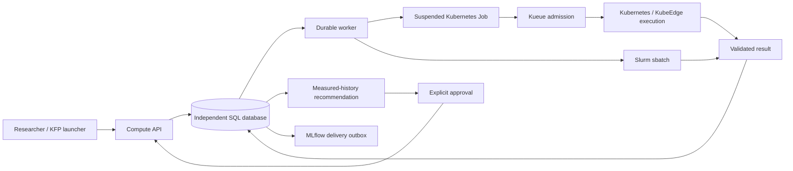

# Resource Advisor

An independent, evidence-based resource recommendation and execution service
for heterogeneous Kubernetes/KubeEdge and Slurm compute pools.

**Status: initial implementation, not a completed production platform.**
Unit-test performance fixtures use explicitly synthetic data. A separate live
experiment has run on a physical RTX 5080 through Kueue, with measured results
in PostgreSQL and MLflow. See the [hardware report](docs/gpu-experiment.md) for
failures, raw measurements and limits. Separate [Slurm CUDA qualification](docs/slurm-verification.md)
and [quota/priority enforcement](docs/slurm-policy.md) now have live evidence;
its model/API path and NPU qualification remain open.
The [uncached Kubeflow workflow](docs/kubeflow-pipeline.md) has also completed
the API → Kueue → GPU → result path and a duplicate-free replay.
The [Kueue policy trial](docs/kueue-policy.md) also verifies real GPU queueing,
oversized admission refusal and high-before-normal execution.
[Terminal accounting](docs/accounting.md) retains failed/cancelled attempts and
distinguishes observed allocation from requested resources and unknown data.

[Read-only inventory](docs/inventory.md) now separates scheduler requests from
measured CPU/memory/GPU/NPU telemetry and returns unknown for stale data.

Open `/console` on the API origin for the [four-view research console](docs/console.md):
resources/jobs, compatibility, queue/allocation history, and recommendation evidence.

The [approved GPU demo](docs/approved-gpu-demo.md) now connects fresh qualification,
three observations, recommendation, approval and independent measured comparison.

## Responsibility

The service validates workload/environment contracts, submits a selected
configuration, collects results and recommends from comparable measured history.
Kueue admits Kubernetes Jobs; Kubernetes and Slurm retain their own scheduling.
Existing edge runtime behavior is unchanged. No runtime migration is implemented.



## Run locally

Python 3.11–3.13 and `uv` are required. Commands below assume this directory.

```sh
uv sync --locked
uv run pytest -q
uv run resource-advisor init-db
```

Create a private credentials JSON outside version control. Its keys are SHA-256
hashes of bearer tokens; values are `{"project":"team-a","operator":false}`.
Only operators may register device/runtime qualification and collect results.
Use a separate scoped operator token, never grant researchers operator access.

```sh
uv run resource-advisor serve --credentials /path/to/private/credentials.json
```

API documentation: <http://127.0.0.1:18040/docs>. Authenticated API prefix:
`/api/v1/compute`. Serving the API does not enable backend execution. A worker
needs explicit project-to-cluster routes and externally provisioned permissions.
Use TLS via a reverse proxy or the server certificate/key options beyond localhost.

Set `RA_DATABASE_URL` to an independent PostgreSQL database for deployment.
SQLite is a local development option. `init-db` creates the initial schema;
schema upgrades and an operational migration process are not yet implemented.

## Implemented boundary

- Immutable workload, runtime variant and capability contracts; separate logical
  workload and execution-context signatures.
- Project-derived authorization; stable idempotency keys; durable submit and
  MLflow outboxes; conservative response-loss reconciliation.
- Kubernetes suspended Job builder and Slurm adapters with explicit native
  runtime qualification and verified node-local result transport.
- Digest/schema/attempt validation; quality-gated historical profiles.
- Lookup recommendations with independent-run counts, uncertainty and approval.
- Device allocation units stay separate; missing scheduler times remain null.
- S3 result bundles with verified read-back, project-authorized downloads and
  separate MLflow artifact delivery; see [artifact setup](docs/artifacts.md).
- Prometheus job/outbox metrics; hardware-verified CPU-only KFP launcher with
  caching off, HTTPS verification and Secret-supplied project credentials.
- Cooperative CUDA matmul runner qualified on one physical GPU/runtime combination.

Consent-bound pilot studies, seeded random search and constrained qLogNEI now
use the durable worker with reserved confirmation budgets. Random search and
qLogNEI completed a real GPU loop and independent confirmation, retaining the
baseline; this small smoke experiment does not establish strategy superiority.
NPU readiness requires actual model validation; hardware detection alone is insufficient.

See [implementation ledger](docs/implementation.md) and
[architecture and operational limits](docs/architecture.md).
For the current evidence see [verification](docs/verification.md); for an easy
Korean explanation see [the walkthrough](docs/walkthrough.ko.md).
See [optimization contracts](docs/optimization.md) and the
[full completion audit](docs/goal-audit.md) for the complete remaining scope.
