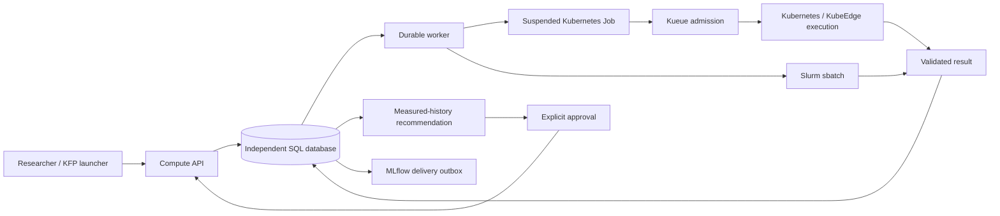

# Resource Advisor

**GPU·NPU 자원을 보고, 작업을 실행하고, 결과와 사용 시간을 확인하는 연구용 프로젝트입니다.**

처음이면 [한국어 사용 가이드](docs/quickstart-ko.md)부터 보세요.
설정된 API 주소의 `/console`에서 다음 순서로 사용합니다.

1. **실행 현황** — CPU·메모리·가속기 자원과 작업 상태 확인
2. **작업 제출 → 템플릿·장비 선택 → 작업 제출** — 새 실행 만들기
3. **실행 상세 · 결과 · MLflow** — 완료 결과 확인; 실행 중에는 **작업 취소** 가능
4. **대기 · 할당 이력** — 기다린 시간과 실제 예약한 자원 시간 확인

Kubernetes/Kueue 및 Slurm 실행을 연결한 실장비 데모입니다.
장비·모델별 지원 범위는 다르며, 모든 가속기와 운영 환경의 검증이 끝난 상태는 아닙니다.

<details>
<summary>기존 실행 결과와 기술 보고서 펼치기</summary>

An independent, evidence-based resource recommendation and execution service
for heterogeneous Kubernetes/KubeEdge and Slurm compute pools.

**Status: initial implementation, not a completed production platform.**
Unit-test performance fixtures use explicitly synthetic data. A separate live
experiment has run on a physical RTX 5080 through Kueue, with measured results
in PostgreSQL and MLflow. See the [hardware report](docs/gpu-experiment.md) for
failures, raw measurements and limits. Separate [Slurm CUDA qualification](docs/slurm-verification.md)
and [quota/priority enforcement](docs/slurm-policy.md) now have live evidence;
a bounded [browser → API → Orin → S3/MLflow result path](docs/slurm-api-results.md)
now also passes, with the initial failed attempt retained. Full Slurm multi-user
and recovery qualification remains open. A separately qualified
[Hailo-8 ResNet-50 API path](docs/hailo-resnet50.md) now completes three
observations, measured lookup, approval and a fourth verification, with matching
PostgreSQL/S3/MLflow evidence. Earlier NPU model failures remain visible.
The [uncached Kubeflow workflow](docs/kubeflow-pipeline.md) has also completed
the API → Kueue → GPU → result path and a duplicate-free replay.
The [Kueue policy trial](docs/kueue-policy.md) also verifies real GPU queueing,
oversized admission refusal and high-before-normal execution.
[Terminal accounting](docs/accounting.md) retains failed/cancelled attempts and
distinguishes observed allocation from requested resources and unknown data.

[Read-only inventory](docs/inventory.md) now separates scheduler requests from
measured CPU/memory/GPU/NPU telemetry and returns unknown for stale data.
Two standalone hosts now also reach the [Slurm inventory and console](docs/slurm-inventory.md)
through actual mTLS Prometheus observations. A
[restricted controller collector](docs/slurm-controller-results.md) now also
supplies live Slurm node state, CPU/memory/GPU reservations and scoped queue counts.
GPU utilization and Pi NPU execution remain unqualified; registration is not model
execution acceptance. An [isolated Orin runtime](docs/slurm-jetson-runtime-results.md)
now passes its fixed GPU CNN gate under enforced memory limits. A subsequent
[real Slurm CNN job](docs/slurm-cnn-contract-results.md) also emits a validated
platform result envelope. The subsequent [browser/API trial](docs/slurm-api-results.md)
now verifies real submission, result collection and publication.

Open `/console` on the API origin for the [four-view research console](docs/console.md):
resources/jobs, compatibility, queue/allocation history, and recommendation evidence.
Compatible candidates offer observed execution; active jobs offer cancellation.
[Actual Slurm cancellation](docs/slurm-cancellation.md) now verifies terminal
confirmation, retained costs and project/owner filtering.

The [approved GPU demo](docs/approved-gpu-demo.md) now connects fresh qualification,
three observations, recommendation, approval and independent measured comparison.
The [CNN diagnostic trial](docs/bottleneck-diagnostics.md) connects serial phase
measurements to cautious bottleneck hypotheses and a controlled input-reuse test.
The [CUDA kernel follow-up](docs/e5-kernel-results.md) adds actual kernel traces,
separate profiler-off/on comparisons and all failed qualification costs:
17 total GPU Jobs, 54 reservation seconds, unchanged one-GPU allocation.
The [isolated training trial](docs/training-isolation.md) protects the initial
checkpoint/input, verifies repeated GPU training and retains separate output states.
The [failure tracking recovery](docs/failure-tracking.md) retains cancelled and
resultless failed attempts in MLflow, including outage and response-loss checks.
The [uncertainty audit](docs/uncertainty.md) rechecks recommendation evidence before
reuse and compares saved forecasts only with later, unseen measurements.
The [persistent metadata cutover](docs/persistent-postgres.md) preserves all five
database tables across Pod recreation and verifies existing artifact references.
The [supervised API and inventory deployment](docs/service-deployment.md) uses
separate permissions and verifies Pod replacement/collector termination recovery.
The [supervised worker crash trial](docs/worker-recovery.md) kills the controller
after accepted GPU submission and verifies recovery without another Job creation.
The [GPU cancellation trials](docs/cancellation-verification.md) separate request
from confirmed cancellation and preserve completed results across worker restart.
The [termination-retention trial](docs/termination-retention.md) commits kubelet
termination evidence before deleting the Pod record, preserving cancellation
reservation time across worker interruption without estimating unknown intervals.
The [Kubeflow cancellation trials](docs/kubeflow-cancellation.md) confirm external
GPU cleanup after workflow termination and uncatchable launcher process loss.
The [paired calibration protocol](docs/fidelity-calibration.md) preregisters
short/long measurement comparisons and prevents replication-only evidence from
being mislabeled as qualified multi-fidelity optimization.

The [completed S0/S1/S2 comparison](docs/policy-comparison-v2.md) runs lookup,
random search and qLogNEI in three temporal blocks, with fresh frozen history and
a later reference grid. All 129 application results plus three F0 Jobs are accounted
for; no BO selection advantage is demonstrated. Raw data, cost-aware figures,
[offline uncertainty replay](docs/uncertainty-ablation.md), and the retained
failed predecessor are published. The [full acceptance audit](docs/goal-audit.md)
still lists required Slurm and broader failure scenarios. The new
[numerical workload holdout](docs/numerical-workload-holdout.md) reuses existing
GPU results: 18 out-of-range Jobs abstain; nine in-range Jobs are covered by
wide, uncalibrated intervals with 14.71% point error. It is an offline shadow
evaluation and grants no execution authority.

</details>

## Responsibility

The service validates workload/environment contracts, submits a selected
configuration, collects results and recommends from comparable measured history.
Kueue admits Kubernetes Jobs; Kubernetes and Slurm retain their own scheduling.
Existing edge runtime behavior is unchanged. No runtime migration is implemented.



## Run locally

Python 3.11–3.13 and `uv` are required. Commands below assume this directory.

```sh
uv sync --locked
uv run pytest -q
uv run resource-advisor init-db
```

Create a private credentials JSON outside version control. Its keys are SHA-256
hashes of bearer tokens; values are `{"project":"team-a","operator":false}`.
Only operators may register device/runtime qualification and collect results.
Use a separate scoped operator token, never grant researchers operator access.

```sh
uv run resource-advisor serve --credentials /path/to/private/credentials.json
```

API documentation: <http://127.0.0.1:18040/docs>. Authenticated API prefix:
`/api/v1/compute`. Serving the API does not enable backend execution. A worker
needs explicit project-to-cluster routes and externally provisioned permissions.
Use TLS via a reverse proxy or the server certificate/key options beyond localhost.

Set `RA_DATABASE_URL` to an independent PostgreSQL database for deployment.
SQLite is a local development option. `init-db` creates the initial schema;
schema upgrades and an operational migration process are not yet implemented.

## Implemented boundary

- Immutable workload, runtime variant and capability contracts; separate logical
  workload and execution-context signatures.
- Project-derived authorization; stable idempotency keys; durable submit and
  MLflow outboxes; conservative response-loss reconciliation.
- Kubernetes suspended Job builder and Slurm adapters with explicit native
  runtime qualification and verified node-local result transport.
- Digest/schema/attempt validation; quality-gated historical profiles.
- Lookup recommendations with independent-run counts, uncertainty and approval.
- Device allocation units stay separate; missing scheduler times remain null.
- S3 result bundles with verified read-back, project-authorized downloads and
  separate MLflow artifact delivery; see [artifact setup](docs/artifacts.md).
- Prometheus job/outbox metrics; hardware-verified CPU-only KFP launcher with
  caching off, HTTPS verification and Secret-supplied project credentials.
- Cooperative CUDA matmul runner qualified on one physical GPU/runtime combination.

Consent-bound pilot studies, seeded random search and constrained qLogNEI now
use the durable worker with reserved confirmation budgets. Random search and
qLogNEI completed a real GPU loop and independent confirmation, retaining the
baseline; this small smoke experiment does not establish strategy superiority.
NPU readiness requires actual model validation; hardware detection alone is insufficient.

See [implementation ledger](docs/implementation.md) and
[architecture and operational limits](docs/architecture.md).
For the current evidence see [verification](docs/verification.md); for an easy
Korean explanation see [the walkthrough](docs/walkthrough.ko.md).
See [optimization contracts](docs/optimization.md) and the
[full completion audit](docs/goal-audit.md) for the complete remaining scope.

Noise-aware [adaptive replication](docs/adaptive-replication.md) adds independent
probes when descriptive measurement precision is unresolved, with explicit caps
and separate final confirmation. It is distinct from multi-fidelity BO.

The [MF-GP/MF-KG numerical kernel](docs/mfkg-kernel.md) now supports finite-space
configuration/fidelity analysis and a synthetic ask/observe demo. Hardware
qualification and live qualified MF-KG execution remain open gates.
[Immutable fidelity spaces](docs/fidelity-spaces.md) now bind measurement levels
to separate workloads and execute preregistered mixed-workload calibration through
the durable study/Job path. The new path completed 12 actual GPU probes and six
independent target confirmations, with matching S3/API/MLflow results.
[Approved input sampling](docs/sampling.md) additionally completed 18 actual GPU
runs over a finite generated input population, with verified byte-consumption
receipts and matching result bundles. Offline MF-GP/MF-KG analysis uses the 12
probes without submitting jobs; independent confirmations retained the baseline
because improvement was uncertain. Real-dataset fidelity, thermal/rank
qualification and live qualified MF-KG execution remain open.

[Execution-bound thermal observations](docs/thermal-evidence.md) add read-only
NVML measurements around each sampled GPU forward. Missing or ineligible
observations exclude a result from recommendation history and stop the study.
An actual 18-Job GPU trial verified all 240 sensor reads and matching
S3/API/MLflow bundles. Measurement overhead is reported; sustained thermal and
paired-rank qualification remain open.

[Preregistered MF-KG execution](docs/qualified-mfkg.md) now connects accepted
fidelity groups to mixed-workload ask/execute/observe and independent target
confirmation. Qualification, expiry, rank drift and failure fallback are tested
with actual BoTorch and scheduler doubles; a qualified physical GPU trial remains
open. Existing unqualified reports do not authorize this strategy.

[Conditional rank transfer](docs/transfer.md) distinguishes history-guided warm
start from actual RGPE. Operator-approved families and immutable source Job/profile
evidence enable a durable target-check → model → reserved Job → observation loop,
with source-expiry/negative-transfer fallback and independent target confirmation.
The [completed physical GPU comparison](docs/transfer-gpu.md) records 157 API Jobs,
two method blocks, full source costs and equal target budgets. All four methods
selected the same configuration: this fixture demonstrates no selection advantage
for transfer. Numerical failure tests remain explicitly synthetic; broader
effectiveness and live harmful-transfer injection remain unverified.

공통 정책 API와 웹 제출 흐름: [SchedulingProfile 가이드](docs/scheduling-profiles.md).

연구 운영 화면과 MLflow/Kubeflow 연결: [Research Console](docs/research-console.md).
