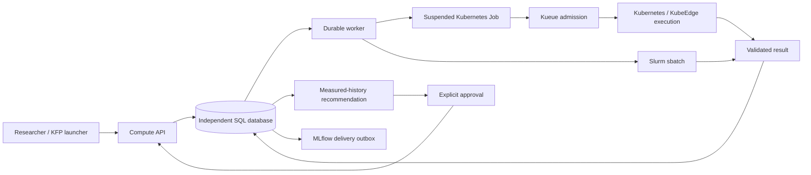

# Resource Advisor

An independent, evidence-based resource recommendation and execution service
for heterogeneous Kubernetes/KubeEdge and Slurm compute pools.

**Status: initial implementation, not a completed production platform.**
Current tests use explicitly synthetic data. No GPU/NPU benchmark or live
scheduler integration result is implied by a passing unit test.

## Responsibility

The service validates workload/environment contracts, submits a selected
configuration, collects results and recommends from comparable measured history.
Kueue admits Kubernetes Jobs; Kubernetes and Slurm retain their own scheduling.
Existing edge runtime behavior is unchanged. No runtime migration is implemented.



## Run locally

Python 3.12–3.13 and `uv` are required. Commands below assume this directory.

```sh
uv sync --locked
uv run pytest -q
uv run resource-advisor init-db
```

Create a private credentials JSON outside version control. Its keys are SHA-256
hashes of bearer tokens; values are `{"project":"team-a","operator":false}`.
Only operators may register device/runtime qualification and collect results.
Use a separate scoped operator token, never grant researchers operator access.

```sh
uv run resource-advisor serve --credentials /path/to/private/credentials.json
```

API documentation: <http://127.0.0.1:18040/docs>. Authenticated API prefix:
`/api/v1/compute`. Serving the API does not enable backend execution. A worker
needs explicit project-to-cluster routes and externally provisioned permissions.
Use TLS via a reverse proxy for access beyond localhost.

Set `RA_DATABASE_URL` to an independent PostgreSQL database for deployment.
SQLite is a local development option. `init-db` creates the initial schema;
schema upgrades and an operational migration process are not yet implemented.

## Implemented boundary

- Immutable workload, runtime variant and capability contracts; separate logical
  workload and execution-context signatures.
- Project-derived authorization; stable idempotency keys; durable submit and
  MLflow outboxes; conservative response-loss reconciliation.
- Kubernetes suspended Job builder and Slurm script/command adapters.
- Digest/schema/attempt validation; quality-gated historical profiles.
- Lookup recommendations with independent-run counts, uncertainty and approval.
- Device allocation units stay separate; missing scheduler times remain null.
- Prometheus job/outbox metrics.

Pilot execution and BO search are deliberately rejected until the budgeted
worker and independent confirmation are implemented. NPU readiness requires
actual model validation; hardware detection alone is insufficient.

See [implementation ledger](docs/implementation.md) and
[architecture and operational limits](docs/architecture.md).
