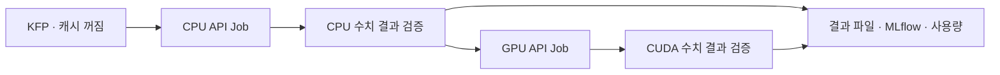

# 실제 CPU → GPU 계산 파이프라인 결과

**캐시를 끈 KFP workflow에서 별도 CPU 계산 Job 완료 뒤 GPU 계산 Job이
실행됐다.** 두 작업 모두 결과 검증, PostgreSQL 사용량 원장, FINISHED MLflow
run, S3/API/MLflow의 동일 결과 파일을 확인했다. 전체 HAIRP 완료 판정과는
구분한다. [공개 측정·증거 JSON](evidence/cpu-gpu-m1-v2-result.json),
[v1 계획](cpu-gpu-pipeline-plan.md), [v2 사전 고정 계획](cpu-gpu-pipeline-plan-v2.md)을
함께 제공한다.

## 무엇을 실행했나

| 구분 | CPU 계산 | GPU 계산 |
|---|---|---|
| 실제 장치 | Intel Core Ultra 9 285 | NVIDIA GeForce RTX 5080 |
| 계산 | Python FP64 scalar 64×64 행렬 곱 | PyTorch CUDA FP32 256×256 행렬 곱 |
| 환경 | Python 3.11.15, Linux amd64 | 기존 qualified PyTorch 2.8.0+cu128, CUDA 12.8 |
| 계산 반복 | 5회, 별도 warmup 1회 | 20회, 별도 warmup 3회 |
| 요청 자원 | CPU 1, 메모리 512MiB, 가속기 0 | CPU 1, 메모리 2GiB, 물리 GPU 1 |
| 수치 일치율 | 1.0, 독립 닫힌식 oracle | 1.0, 기존 CUDA fixture 검증 |
| API 상태 / MLflow | SUCCEEDED / FINISHED | SUCCEEDED / FINISHED |
| 결과 파일 | API·S3·MLflow bytes 일치 | API·S3·MLflow bytes 일치 |
| 해당 API 작업 예약 시간 대용값 | CPU core 1초, GPU 0초 | CPU core 2초, GPU 2초 |

성공한 KFP run은 `0bcd7480-8a4d-4759-b155-37b26b46ad17`이다.
CPU Job `j-d6192ec60fc9466dacf2ca12c2c417ac`과 GPU Job
`j-f3a1568407c646c093bbefdf5a20ff2f`는 서로 다른 attempt/native Job이다.
GPU API 생성 시각이 CPU 결과 검증 후 완료 시각보다 늦음을 확인했다.
각 attempt에 원장 한 행과 MLflow run 한 개가 연결됐다.

CPU runner는 CUDA/PyTorch를 import하지 않고 가속기 요청도 하지 않는다.
CPU 결과의 peak memory는 프로세스 host RSS이며 GPU 메모리가 아니다.
CPU와 GPU는 행렬 크기·정밀도·구현·반복 수가 다르므로 두 시간을 나누어
GPU 속도 향상으로 표시하지 않는다. 이 파이프라인은 **실행 순서 의존성**을
검증한다. CPU 결과를 GPU 입력 데이터셋이나 학습 모델로 전달하는 흐름은 아니다.

## 실패와 재시도도 포함한 비용

| 실행 | 실제 계산 Job 수 | GPU 예약 시간 대용값 | CPU core 예약 시간 대용값 |
|---|---:|---:|---:|
| v1 qualification — 계약 준비 오류로 거절 | 2 | 2초 | 11초 |
| v2 qualification — 전체 canonical 계약 통과 | 2 | 2초 | 3초 |
| v2 성공 KFP의 API 계산 | 2 | 2초 | 3초 |
| 계산 합계 | 6 | 6초 | 17초 |

v1은 계산이 정상 종료했어도 전체 QualityPolicy 대신 일부 필드만 서명해
등록 검증에서 실패했다. API Job이나 KFP run을 만들지 않았고 실패와 비용을
[별도 원본 보고](evidence/cpu-gpu-m1-v1-failure.json)에 보존했다.
v2는 제출 전 전체 계약과 serialization roundtrip을 확인하고 새 식별자로
qualification을 수행했다. 품질·메모리·쿼터 기준을 낮추지 않았다.

v2의 첫 KFP run `436b87e2-c0b7-4ad6-a26c-5bf9a442730f`도 FAILED로 남겼다.
오래된 launcher image가 `--owner-lease-seconds`를 지원하지 않아 CPU API
제출 전에 종료됐다. GPU 단계는 실행되지 않았다. 현재 worker와 같은
검증된 launcher image로 수동 재실행했고, 동일 CPU/GPU run key를 유지했다.
v2의 실제 계산 Job은 qualification 2개와 API 2개, 계획한 4개 이내다.

실패·성공 workflow의 driver/launcher Pod 8개는 모두 가속기를 요청하지
않았다. 각 main container의 CPU 요청량 × PodScheduled부터 해당 container
종료까지의 구간을 합치면 **10.1 CPU core초**다. 계산 구간과 이를 더한
알려진 소계는 **27.1 CPU core초**다. controller, init/wait container와
상시 플랫폼 서비스의 비용은 포함하지 않아 플랫폼 전체 비용은 unknown이다.

이 시간들은 초 단위 native timestamp와 **예약 요청량의 대용값**이다.
물리 CPU/GPU 사용률, 실제 전력량 또는 Kueue의 정확한 쿼터 반환 시각이 아니다.
CPU container의 시작·종료가 같은 초로 기록돼도 측정 계산시간은 약 28ms로
별도 저장했다. 센서로 측정하지 않은 power/temperature/utilization은 null이다.

## 배포와 보존 확인

계산 runner와 CPU-only allocation 수정의 source는
`b8d24f57bf42f18c40506a9d561f6569a5724639`이다.
[해당 source CI](https://github.com/dsa04156/resource-advisor/actions/runs/37498428045)는
Python 3.11/3.13, SQLite/PostgreSQL 및 기존 정적 검사에서 성공했다.
영향받는 계산·파이프라인·backend·accounting 검사 50개도 통과했다.
worker만 pinned manual ArgoCD로 배포했고 실제 source hash 및 Synced/Healthy,
Ready 상태를 확인했다. API와 나머지 서비스의 source revision은 별도로 유지했다.

기존 entity 4,477개, 작업 identity 592개, terminal Job 591개, 원장 591개와
정적 spec/UID·Secret·PVC·쿼터를 보존했다. 이 비교는 기존 데이터의 보존을
뜻하며 새 계약 등록이나 새 작업 2개의 정상 추가를 막는 조건은 아니다.
자기 qualification Job만 삭제하고 API native Job은 근거로 유지했다.
최종 queue의 pending/admitted/reserving은 모두 0이었다.

## 완료 범위

M1의 별도 CPU→GPU 정상 계산 경로에 직접 근거가 추가됐다. 기존
[KFP 취소·launcher owner-loss](kubeflow-cancellation.md)
시험은 GPU cleanup의 별도 근거로 유지한다. 이번 정상 실행에서 CPU 단계
취소를 새로 시험한 것은 아니다. 처음 요청한 Benchmark/Training/Edge Deployment/
Runtime Evaluation 네 종류 전체 pipeline, Edge stage 재계획, HAMi 간섭,
eBPF 통합과 전체 M0–M6 완료를 대신하지 않는다.
