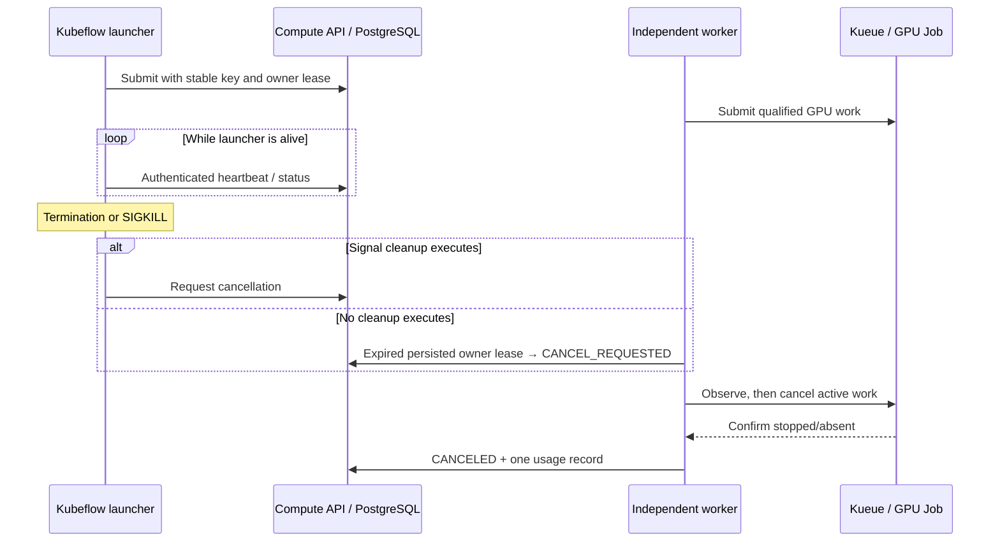

# Kubeflow cancellation reaches external compute

Kubeflow owns the workflow launcher; the independent worker owns the external
compute Job. Terminating the launcher Pod alone does not delete that GPU Job.
The launcher now opts into a persisted ownership lease as well as attempting
immediate API cancellation when it receives a termination signal.

## Actual trials

The [raw sanitized evidence](evidence/kubeflow-cancellation.json) separates two
uncached KFP workflows on the existing cluster. Both first reached a real
RTX 5080 allocation and initialized CUDA. The workload then waited 30 seconds
before matmul; cancellation happened during this preparation window, so these
trials are not successful benchmark measurements or useful GPU computation.

| Trial | Pipeline state | Compute state | Interruption to confirmed cleanup |
|---|---|---|---|
| KFP terminate | FAILED | CANCELED | 13.537851 seconds |
| Python launcher SIGKILL | FAILED | CANCELED / OWNER_LEASE_EXPIRED | 23.951984 seconds |

Each trial produced one usage row and one KILLED MLflow run, with no successful
result. The final LocalQueue had zero pending, admitted and reserving workloads.
The normal termination container exited 143. In the SIGKILL trial the pipeline
container wrapper exited 1 after its Python child was killed; that observed
wrapper code is not mislabeled as 137. Both allocations were observed as one
GPU, but deleted-Pod termination times were unavailable, so GPU-seconds remain
unknown. All ten nodes were Ready without pressure at the final check.

1. **Kubeflow terminate:** call the installed client's `terminate_run(run_id)`
   after the CUDA marker. The launcher's termination handler requests API
   cancellation and the independent worker cleans up the GPU Job.
2. **Uncatchable launcher loss:** locate the single Python launcher process in
   its own pipeline container and send SIGKILL. No GPU process, worker or shared
   service is killed. A deliberately short 20-second ownership lease lets the
   independent worker identify the orphan while compute is still preparing.

The normal pipeline default remains 60 seconds. Only the isolated SIGKILL trial
uses 20 seconds. The launcher reserves CPU/memory and no accelerator; the
external Job requests one physical GPU through Kueue. The latter must be
observed canceled, with both Job and Pods absent and queue allocation released.
The pipeline's own final state is recorded separately rather than relabeled
to match the Compute API outcome.

## Reproduction and limits

Compile [the pipeline](../examples/pipeline.py), deploy the matching API/worker,
and use a digest-pinned launcher image. Supply the TLS CA and project token via
the existing Secret. Register a fresh independently qualified delayed GPU
workload; record its immutable source/runtime references. Use distinct run keys
for the two trials and preserve each run ID across observation retries.

Wait for the compute Pod's real CUDA marker before injecting a failure. For the
second trial, require exactly one matching launcher process and verify that it
is not namespace PID 1 before sending SIGKILL; do not broaden the kill pattern.
Observe persisted heartbeats, expiry, cancellation intent, backend confirmation,
one ledger and one MLflow run. Check the final queues and service readiness.
Do not claim success from workflow failure alone.

Tests also cover pre-submit expiry with zero allocation, lost submit response,
worker recreation, rejected late heartbeat, project isolation, legacy idempotency
digests and ordinary jobs without ownership leases. These are simulated boundary
tests, not additional hardware trials.

This does not establish immediate resource release during a database, worker or
scheduler outage. Expiry waits for an operational worker and confirmed backend
cleanup. Queued/submitted-unknown attempts retain conservative reconciliation;
they are never declared free merely because the launcher disappeared. A job
already completed may still be collected successfully. Slurm-specific owner-loss
cleanup, real network partitions, and concurrent-owner/worker fencing remain
separate acceptance gates.
