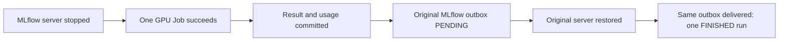

# Actual MLflow outage with a successful GPU result

**PASS for the frozen qualified CUDA fixture.**
[Protocol](mlflow-server-outage-v2-plan.md) was published in `0728704` before
the single new compute submission and server interruption.
[Sanitized evidence](evidence/mlflow-server-outage-v2.json) records the original
accepted Job, retained verifier failure and successful supplemental readback.
The previous [failed trial](mlflow-server-outage.md) remains INCOMPLETE.

## What actually happened

The dedicated lab MLflow3.16.1 server was scaled1→0. Independent observation
confirmed zero serving Pods and ready endpoints. One API observe Job used the
already [qualified explicit runtime bundle](kubernetes-runtime-bundles.md),
unchanged FP32 256×256 matmul/seed0/20 iterations, one GPU, one CPU and2GiB.
The existing trusted worker submitted it through Kueue, collected a real CUDA
result with numerical agreement1 and committed one usage ledger.

While the server was still unavailable, the original MLflow outbox was PENDING,
with one delivery attempt and an actual `RemoteProtocolError`. No tracking
link existed. The result/profile and ledger already existed independently of
MLflow. The server was restored in the original verifier's finally-protected
flow; its Deployment UID/specification, Service and PVC were preserved and it
returned1/1 Ready. The SAME outbox reached DONE after three delivery attempts.

Independent supplemental reads verified one FINISHED MLflow run, matching
project/job/attempt/signatures/metrics/end time, and byte-identical
SQL/API/S3/MLflow result bundle. Repeating the original API key returned the
same attempt. Exactly one new native Job/Pod existed, without container
restarts. All preexisting immutable entities, ledgers, terminal Jobs, native
specifications and full MLflow run bodies matched their pre-outage snapshot.
No tracking delivery was left pending. No replacement GPU computation ran.

## Retained reporting errors and costs

The original verifier exited1 after execution/recovery/artifact checks, because
it compared memory strings: the API canonicalized `2048Mi` as `2Gi`. Actual
requests AND limits remained exactly one CPU/2GiB/one GPU. The corrected check
uses the existing Decimal quantity parser, preserves exact resource keys and
rejects different CPU/GPU counts, decimal2GB and1GiB. Eight focused regression
cases passed; Ruff check/format passed after the test-format correction.

The original report is retained unchanged. A first supplemental readback had
an incorrect local repository path and stopped before the resource check;
corrected read-only reconciliation exited0 against the SAME completed Job.
Neither reporting error triggered a new allocation or another server outage.
This is not an uninterrupted successful run of the original verifier CLI.

The before-restoration outage observation was12.004seconds; restoration was
requested12.681seconds after the stop sequence began, and the restored server
answered19.495seconds after it began. These are observation/administrative
boundaries, not a claim of precise network-unavailability duration.
The new allocation consumed2GPU reservation seconds and2CPU core-seconds.
Including the earlier failed allocation1GPU-second and separate normal-service
qualification2GPU-seconds gives5GPU reservation seconds. Full values and
unknown utilization/power/temperature are retained in the JSON evidence.

Temporary PostgreSQL/S3/MLflow verification forwards were closed; the persistent
HTTPS API and existing compute/runtime configurations were preserved.
The unrelated disconnected Slurm cancellation remains unresolved.

This verifies the fixture's actual service interruption and delivery recovery.
It does not certify MLflow tenant isolation, distributed exactly-once delivery,
every backend partition, disconnected-node accounting or full HAIRP completion.
