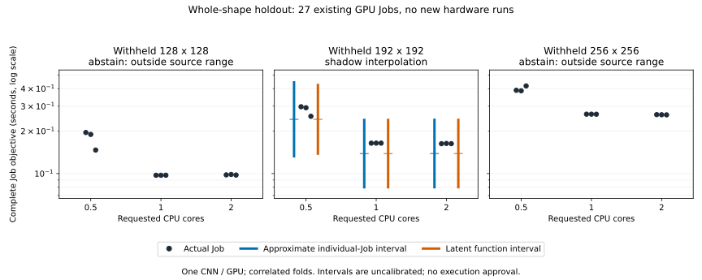

# Source-only numerical workload holdout

The new offline shadow GP predicts a withheld input shape without receiving any
of that shape's outcomes. In the only in-range fold, all nine actual durations
fall within its intervals, but the point error is **14.71%** and the approximate
individual-Job interval is **218.19 ms wide on average**. This is broad coverage,
not evidence of precise prediction or a 95% operational guarantee. Both outer
shapes abstain because their inputs lie outside their respective training ranges.

[Raw report](evidence/numerical-workload-holdout-v1.json) ·
[Fixed analysis protocol](numerical-holdout-plan.md) ·
[Reproduction file hashes](evidence/numerical-holdout-provenance-v1.json) ·
[Original GPU trial](transfer-gpu.md)



## What was implemented

`workload_uncertainty.py` accepts validated source cells and separate target
descriptors that contain no measurements. It checks workload separation,
distinct input shapes, complete CPU grids, repeated Job IDs and finite timings.
Family/runtime changes, unseen configurations and out-of-source-range inputs
abstain before importing or fitting the model. Fit failures also abstain; a
partially produced prediction cannot survive a later failure.

The caller first audits the original capture's result digests, study/plan scope,
measurement identity, runtime contexts, quality contracts and chronology using
the existing [rank-holdout auditor](workload-holdout.md). Shape/dataset labels are
limited to the captured generated-input family. A family fingerprint is not an
automatic claim that another model or runtime is compatible.

The model is a new **shadow-only** log-duration GP over input pixel area and CPU
request. It does not change the running BO/RGPE implementations, overwrite any
saved forecast or issue a recommendation. Target outcomes are only passed to
the scoring function after predictions exist. All feature bounds, output
normalization, noise estimates and fitting use source data alone.

Each training point is the mean of three log Job durations with estimated
variance of that mean. The latent interval describes the underlying log-time
function. The approximate individual-Job interval additionally uses pooled
within-cell log variance from source shapes at the same CPU request; it is
**not divided by the repeat count**. The reported point is exp(log mean), a
predictive median, not an arithmetic mean. The model does not predict memory
or accuracy; the report scores actual constraint violations independently.

This noise transfer assumes that source variability applies to the new shape.
It omits variance-estimation and hyperparameter uncertainty. Three repeats per
cell do not validate log-normality or stable residual variance. The raw data
show more variability at CPU 0.5 than at CPU 1/2; every point is retained.
No p-values, normality acceptance claim or significance-based model selection
is used. Fixed-noise [BoTorch models](https://botorch.org/docs/models) do not
learn new observation noise automatically; the added variance is explicitly
this analysis's assumption.

## Results and exclusions

| Withheld shape | Source shapes | Prediction / abstention Jobs | Job interval coverage | Mean width | Mean absolute relative error | Sources before target |
| --- | --- | ---: | ---: | ---: | ---: | --- |
| 128×128 | 192, 256 | 0 / 9 | Not applicable | Not applicable | Not applicable | No |
| 192×192 | 128, 256 | 9 / 0 | 9 / 9 | 218.19 ms | 14.71% | No |
| 256×256 | 128, 192 | 0 / 9 | Not applicable | Not applicable | Not applicable | Yes |

The middle fold's latent intervals also cover 9/9, with mean width 210.04 ms.
Adding individual noise increases width; it does not fix the point error or
establish calibrated coverage. All 27 completed target Jobs pass their recorded
numerical-agreement and memory constraints, including the 18 abstained Jobs.
Abstentions are neither misses nor successes, and their coverage is `null`.

The numerical fold is retrospective: its 256×256 source results were measured
after its 192×192 targets. It is a valid grouped workload split but **not a
chronological numerical forecast**. The only chronologically ordered fold is
out of source range and correctly abstains. Thus this dataset provides no
non-abstaining, chronological, source-only numerical prediction evidence.

The report separately preserves the original 24 actually saved chronological
forecasts unchanged: qLogNEI 8/10 covered, warm-start BO 8/10, RGPE 0/4. Those
models use target pilots; their coverage cannot be pooled with this new
source-only GP. The 133 no-forecast exclusions remain recorded.

Only the 27 balanced confirmation Jobs enter the grouped analysis. The other
130 original Jobs are listed by attempt ID outside those grids. All nine Jobs
of a target shape are excluded from its model; the 18 source confirmations are
listed separately. Repetitions stay together, and folds share source data.
Three shapes of one fixed CNN on one GPU are not three independent model families.

## Cost, reproduction and authority

There are **zero new GPU Jobs**. The original 157 application Jobs cost 437 GPU
reservation seconds; their 38 qualification seconds remain separately recorded,
475 seconds overall. Reusing evidence is not free history or a runtime saving.
The new numerical fit took 1.110 seconds of local wall time, including imports,
preparation and inference; it is not measured CPU utilization or GPU time.
Other folds abstained without fitting. BoTorch 0.16.1, PyTorch 2.8.0+cpu and
GPyTorch 1.15.2 are recorded with each fit. Seed and options are in the protocol.

```sh
uv sync --locked --extra optimizer
uv run python examples/evaluate_numerical_holdout.py \
  --input docs/evidence/transfer-gpu.json \
  --output /tmp/numerical-workload-holdout.json
uv run --no-project --with matplotlib==3.10.7 python examples/plot_numerical_holdout.py \
  --input /tmp/numerical-workload-holdout.json \
  --output /tmp/numerical-workload-holdout.svg
```

Output files must not exist. The plot needs Matplotlib only for report generation;
the platform dependency lock is unchanged. No credentials or scheduler access
are needed. Reproduction tests compare numerical output with small floating-point
tolerance and ignore measured analysis wall time, not changes to coverage or
abstention. Further tests alter held-out outcomes, reject identity/attempt leaks,
check individual versus mean noise, and preserve random/thread state on failure.

This adds bounded numerical workload-holdout evidence required by R4 alongside
the existing chronological audit. It does not validate unrelated workloads,
new accelerators, unseen runtimes or prospective source-only accuracy. Those
categories continue to abstain. The full project remains incomplete, including
actual end-to-end execution on both required Slurm devices. No existing
qualification, approval, workload profile or deployment changes in this analysis.
