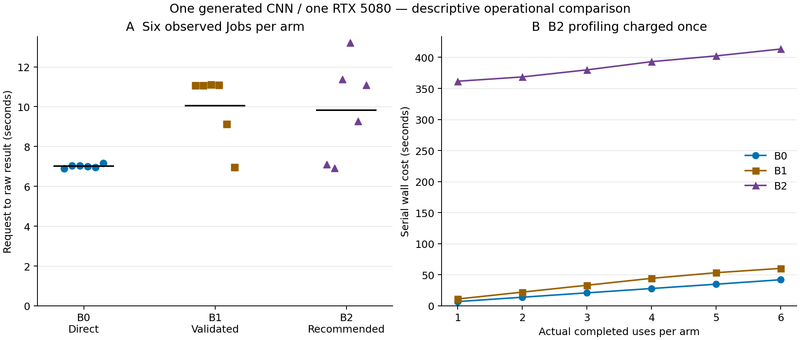

# Actual B0/B1/B2 operational GPU comparison

The prospectively allocated comparison completed **35 GPU Jobs**: three fresh
qualifications, 14 profiling/confirmation Jobs and 18 main Jobs. All main runs
passed the unchanged numerical-agreement and memory gates. The recommended
configuration made the measured compute boundary about **1.0% shorter**, but
its profiling cost was not recovered over the six actual uses. This is a null
net-benefit result on this short workload, not a general rejection of profiling.

- [Frozen plan](operational-comparison-plan.md), pushed in `50f1dd1` before qualification.
- [Complete evidence](evidence/operational-comparison-v1.json), including all main,
  profiling, qualification and collector-recovery records.
- [Audited summary](evidence/operational-comparison-v1-summary.json) and
  [main-run CSV](evidence/operational-comparison-v1.csv).
- [Offline auditor](../examples/evaluate_operational_comparison.py).



Points are individual Jobs; black lines are means, not confidence intervals.
Cumulative lines join actual repeat counts and do not extrapolate a break-even
point. Shared qualification is reported separately. [SVG](evidence/operational-comparison-v1-figure/comparison.svg),
[figure data](evidence/operational-comparison-v1-figure/raw-main.csv),
[cumulative data](evidence/operational-comparison-v1-figure/serial-cost.csv) and
[manifest](evidence/operational-comparison-v1-figure/manifest.json) support reuse.

## What differed between the arms

| Arm | Execution path | Fixed main-run allocation |
| --- | --- | --- |
| B0 | Direct standard Kubernetes Job and raw collection; no Advisor API, profile record or approval | CPU 1, GPU 1, memory 2 GiB |
| B1 | Advisor observe mode: compatibility and identity checks, worker, validated result, PostgreSQL and S3/MLflow links | Same CPU 1 baseline |
| B2 | Fresh qLogNEI profiling, independent confirmation, immutable approval and fixed-mode execution through the platform | Confirmed CPU 2, same GPU 1 and memory 2 GiB |

All arms used the same physical RTX 5080, digest-pinned image and source,
PyTorch 2.8.0+cu128, CUDA 12.8, driver 595.84, existing Kueue queue and normal
priority. Existing CPU 2/GPU 1 quota was not expanded. The stateless Kubernetes
manifest renderer was reused to keep mounts, resources and runtime environment
identical; B0 bypassed the API, database, Advisor and worker. Its six external
Jobs are verified absent from platform Job/profile records.

The workload is the published generated three-convolution CNN, seed 20261004,
input `[1,3,256,256]`, FP32, three warmups and 12 measured blocks of 32 CUDA
forwards. Each measured block includes CPU preprocessing, transfer and GPU
synchronization. These are whole-objective times, **not individual request
latencies**. Numerical agreement 1.0 verifies the generated CPU reference; it
does not measure trained-model task accuracy.

Six temporal blocks each contain B0/B1/B2 once, following the frozen random
order. One tuning episode precedes every main run. It used eight probes and
six fresh confirmations, made five real qLogNEI choices and had zero random
fallbacks. Main results never entered its model or confirmation data. CPU 1
was retained as the reasonable control even though earlier research suggested
CPU 2 might be slightly faster. Nothing forced B2 to outperform that control.
The unchanged runner derives PyTorch threads as `max(1, int(requested_cpu))`;
CPU 2 therefore also uses two host threads. GPU count and GPU model stay fixed.

## Observed execution and allocation

| Arm | Main Jobs | Request→raw result, mean ± sample SD | Compute boundary, mean ± sample SD | Main GPU reservation | Main CPU core reservation |
| --- | ---: | ---: | ---: | ---: | ---: |
| B0 | 6 | 7.011 ± 0.094 s | 263.762 ± 0.427 ms | 16 GPU-s | 16 core-s |
| B1 | 6 | 10.062 ± 1.712 s | 263.738 ± 0.404 ms | 15 GPU-s | 15 core-s |
| B2 | 6 | 9.826 ± 2.515 s | 261.106 ± 0.500 ms | 14 GPU-s | 28 core-s |

The mean B1-minus-B0 raw-result difference is 3.051 seconds. It includes the
platform submission/worker path, polling and scheduling, not just validator
CPU time. B2's compute mean is 2.631 ms lower than B1, while its main CPU core
reservation is higher. The small physical GPU-second difference uses
whole-second scheduler timestamps; it is not proof of improved utilization.
No resource prices or combined CPU/GPU savings percentage are invented.

The request-to-raw-result endpoint uses the same external status/log collection
for all arms. API validation and artifact completion are separate endpoints.
Application-recorded creation→validation averages were 9.922 s for B1 and 12.275s
for B2; creation→linked-delivery averages were 10.258 s and 12.621 s. These use
application-record timestamps, whereas raw-result durations use client
observations. They must not be added together as successive phases.

All 32 main/profiling traces passed the fixed thermal policy. Maximum sampled
temperature was 54°C. NVML queries totaled 0.083242 s, with maximum individual
query 0.002978 s and maximum unobserved gap 0.072211 s. This quantifies that sensor
component, not total instrumentation overhead or a continuous utilization/
energy measurement. Raw phase traces and scheduler queue/preparation/container
boundaries remain available separately.

## First-use and actual repeated-use costs

B2 profiling/confirmation and approval preparation consumed 354.439 s of client
wall time, 49 GPU reservation seconds and 48.5 CPU core reservation seconds.
This complete measured setup is charged once, not hidden as free historical
data. Qualification cost 8 GPU-s is shown separately as shared setup.

| Arm | First use: setup + raw-result wall | Six uses: setup + serial raw-result wall | GPU-s through six uses | CPU core-s through six uses |
| --- | ---: | ---: | ---: | ---: |
| B0 | 6.890 s | 42.065 s | 16 | 16 |
| B1 | 11.068 s | 60.369 s | 15 | 15 |
| B2 | 361.536 s | 413.395 s | 63 | 76.5 |

The common raw-result endpoint does not include every platform validation or
delivery delay. Including actual observed completion through linked delivery
for B1/B2 gives six-use totals of **42.065 s / 255.411 s / 437.761 s** for
B0/B1/B2; B1 includes the collector interruption described below. Using the
separately retained application-record creation→delivery durations gives
**61.547 s for B1 and 430.167 s for B2**, with B2 setup still charged once.
B0 has no such platform endpoint and remains null in that column. Every
N=1..6 value for all three timing definitions is in the summary. The observed
interruption is neither dropped nor used to claim that B1's server is slow.

The machine-readable summary contains every actual N=1..6 value. These are
serial sums for each arm plus its own setup, not the experiment's interleaved
makespan or a prediction for parallel traffic. The entire observed protocol
elapsed 888.374 s and reserved 102 GPU-s including all qualification, profiling
and main Jobs. No failed GPU Job was discarded or replaced.

Image/runtime provisioning and operator registration remain existing lab setup;
their full lifecycle cost is not quantified by this request-path comparison.
The experiment does not claim cold-cache deployment cost or a production
break-even count. This short workload gives little compute time to recover a
several-minute tuning episode; preserving the fixed baseline is a credible
operational choice.

## Collector interruption is retained

Before profiling submission, the private driver stopped on a Decimal/float
accounting conversion. The three completed F0 Jobs were retained and reused
after the conversion fix; no qualification Job was replayed.

After the first B1 raw result, the driver stopped while trying to JSON-serialize
a SQLAlchemy row mapping. The saved API Job was already successful with linked
artifacts. Recovery retained the same Job ID, raw-result time and measurement;
it saved stable entity references instead of the row wrapper. No new Job was
submitted to replace it, and the planned arm sequence remained unchanged.

That Job's observed delivery time is 199.923 s because it includes the collector
interruption. Its application records show validation 13.787 s and linked
delivery 14.167 s after API creation. Both remain in the CSV/JSON. The primary raw
endpoint 11.068 s was durably saved before the interruption. The long observation
must not be called server validation overhead or silently replaced with the
shorter recorded timestamp. The gap remains in the whole-protocol makespan.

## Verification and reproduction

All 26 API-owned Jobs (14 profiling + 12 main) matched one successful backend
Job/Pod, Kueue admission, one usage record, one MLflow run and identical
S3/authenticated-API/MLflow artifact bytes. The six direct B0 Jobs had the same
queue/resource/quality checks and retained raw outputs without platform
records. Every Job/attempt/backend ID is distinct. Source ConfigMap contents,
runtime and quota were unchanged during measurement.

Three qualified runtime bindings were added and one idle lab worker reloaded
before the trial. From the subsequent baseline snapshot to completion, nine
static object specs/identities, four core Pod identities/container states and
Secret/PVC references were unchanged. Four core Argo applications remained
Synced/Healthy at their existing revision. The 26 new Job/usage records,
one study and 130 completed outbox items are expected new data; the database
was not claimed unchanged. All 10 nodes were Ready without pressure and the
queue/outbox were empty at final capture.

Reproduce the report without credentials or new hardware work:

```sh
uv sync --locked
uv run python examples/evaluate_operational_comparison.py \
  --capture docs/evidence/operational-comparison-v1.json \
  --plan docs/evidence/operational-plan-v1.json \
  --output /tmp/operational-audit.json
uv run --with matplotlib==3.10.7 python examples/plot_operational_comparison.py \
  --capture docs/evidence/operational-comparison-v1.json \
  --plan docs/evidence/operational-plan-v1.json \
  --output /tmp/operational-figure
```

Outputs must be new paths. A new live trial needs fresh qualification and
explicit site routing. Use the frozen workload recipe/quality contract and
register its capability, variants and workload; verify `NEEDS_PROFILE` before
submitting the qLogNEI profiling run. Approve its exact confirmed recommendation
digest. Then follow the frozen schedule: submit B0's standard suspended Job
to the same LocalQueue, B1 through `POST /api/v1/compute/jobs` with
`mode=observe`, and B2 with `mode=fixed` and that approval reference. Retain
accepted IDs before polling, preserve failed outcomes and apply the published
stop rules. Site secrets and raw infrastructure identifiers remain external.

This establishes a bounded B0/B1/B2 operational comparison. One GPU, one
generated inference workload, one tuning episode and six correlated blocks
cannot establish fleet effectiveness, training-quality benefit, Slurm/NPU
equivalence or reliable tail latencies. Those claims remain outside this result.
