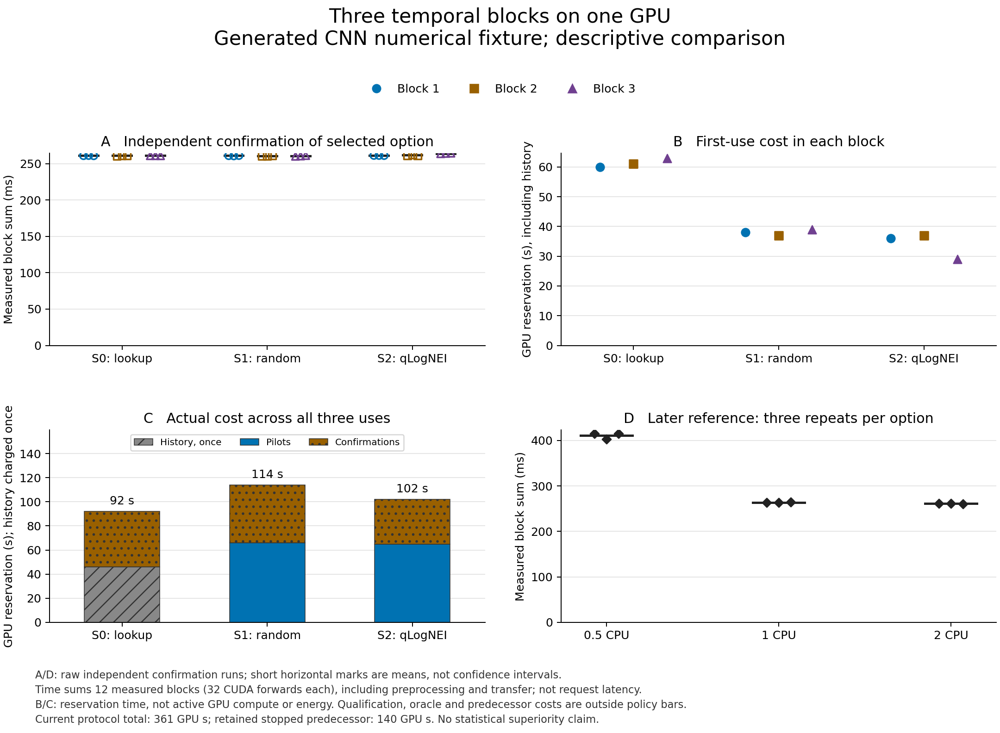

# Completed policy comparison after the worker runtime repair


The completed comparison does **not demonstrate a qLogNEI selection advantage**.
Lookup and random search selected 2 CPU cores in all three blocks. qLogNEI selected
2, 2 and 1; the later reference mean for 1 CPU was 0.969% above the smallest mean.
That is a descriptive finite-sample regret, not statistical proof of inferiority.
The baseline was a reasonable 1 CPU configuration, not an intentionally weak
setting. All variants used one physical RTX 5080 GPU and the same generated CNN.
The objective was fixed-work completion time. Requesting 2 CPU cores rather than
1 doubles the declared CPU allocation for this small observed timing difference;
the GPU-reservation plots do not establish better total CPU/GPU efficiency.

[Full capture](evidence/policy-comparison-v2.json),
[audited summary](evidence/policy-comparison-v2-summary.json),
[all 129 application observations as CSV](evidence/policy-comparison-v2.csv), and
[completion/infrastructure checks](evidence/policy-v2-completion.json) preserve
actual attempts, backend IDs, run links, numerical results, thermal traces and
costs. The three F0 Jobs are recorded separately: **132 GPU Jobs total**.



[Vector figure](evidence/policy-comparison-v2-figure/comparison.svg),
[figure source data](evidence/policy-comparison-v2-figure/study-summary.csv),
[raw selected confirmations](evidence/policy-comparison-v2-figure/selected-confirmations.csv),
[raw reference confirmations](evidence/policy-comparison-v2-figure/oracle-confirmations.csv),
and [transformation/provenance manifest](evidence/policy-comparison-v2-figure/manifest.json)
are provided. Points are independent runs and short marks are means, not confidence
intervals. The plotted duration sums 12 measured blocks with 32 CUDA forwards per
block, including CPU preprocessing and transfer. It is not per-request latency.

## Observed decisions and costs

Values within a cell are ordered by temporal block 1 / 2 / 3. GPU seconds mean
scheduler-observed reservation time, with second-resolution timestamps; they are
not active GPU compute time or energy.

| Policy | Selected CPU cores | First-use GPU seconds, history included | Actual three-use GPU seconds, history once | Later reference regret |
|---|---|---|---|---|
| S0 lookup | 2 / 2 / 2 | 60 / 61 / 63 | 92 | 0 / 0 / 0% |
| S1 random | 2 / 2 / 2 | 38 / 37 / 39 | 114 | 0 / 0 / 0% |
| S2 qLogNEI | 2 / 2 / 1 | 36 / 37 / 29 | 102 | 0 / 0 / 0.969% |

Lookup's fresh history cost 46 GPU reservation seconds and 379.185443 wall seconds.
Its first-use wall cost was 529.773–530.554 seconds, versus 344.723–350.995 for
random and 276.566–350.957 for qLogNEI. Once the same history was reused for three
actual comparisons, lookup's total was 92 GPU seconds. This limited reuse result
is not a production break-even estimate or evidence that lookup is always cheaper.
All three methods obeyed the same first-use caps; S0's remaining execution caps
subtracted its measured history cost before submission.

qLogNEI made **15 actual model-based choices**, five in each block, with zero
model-failure random fallbacks. Each cold-start search used eight pilot Jobs.
The third BO study predicted the baseline and therefore needed three independent
baseline confirmations; the other eight studies confirmed both baseline and
finalist with six Jobs. Its lower allocation cost must not be presented as a
speed advantage or an equal-number-of-confirmations comparison.

The later reference measurements, three independent runs per configuration,
had mean measured block sums of 411.383 ms (0.5 CPU), 263.867 ms (1 CPU), and
261.335 ms (2 CPU). These later values were excluded from all policy decisions.
The 0.969% regret is `263.867338 / 261.334668 - 1`; later means have sampling and
time-drift uncertainty and are not known ground truth. No p-values, powered
superiority or generalization to another workload/device are claimed.

## Execution and evidence checks

- All 129 application Jobs have distinct attempt/backend/MLflow IDs, one ledger
  record each, Kueue admission and byte-identical S3/API/MLflow result bundles.
  All 11 studies finished, with zero unfinished delivery events.
- All numerical quality values were 1.0. This is generated-fixture output
  agreement, not classification accuracy of a trained model.
- All execution-bound thermal traces were eligible; maximum observed temperature
  was 55 C. Sensor queries consumed 0.331490 seconds in total, with a maximum
  individual query of 0.003113 seconds. Point power readings spanned 4.530–104.352 W;
  sparse point readings do not establish average utilization or integrated energy.
- Current-trial cost was **361 GPU reservation seconds**: 308 for the three
  methods including history once, 44 for the independent reference grid and 9
  for F0. The stopped predecessor's 140 seconds remain separate, giving **501
  seconds across these two policy trials**. Other platform experiments and
  infrastructure operation are outside this total.
- The complete protocol took 3,565.340 wall seconds, below its frozen 7,200-second
  cap. All 129 queue/preparation/collection intervals were known; their respective
  sums were 15, 112 and 9.890493 seconds. The sum of measured benchmark block times
  was 36.187190 seconds. These boundaries differ from reservation time and full
  orchestration wall time; they are not interchangeable or freely additive.
- The immutable workload source, nine static objects, four core Pod processes,
  Secret/PVC references and versions, four pinned Argo applications, and original
  1 GPU / 2 CPU queue quota were preserved. All ten nodes were Ready without
  pressure; final pending/admitted/reserving queue counts were zero.

The [S5 offline confirmation replay](uncertainty-ablation.md) changed **0/9**
selections when only uncertainty-based baseline retention was removed. Both
policies retained quality/memory/repeat checks. This cohort contained no
uncertainty-triggered baseline retention; it cannot establish that the gate is
unnecessary. Workload holdout and broader uncertainty validation remain open.

## Frozen design and reproducibility

This is a new prospective experiment, not a resumption or replacement of the
[stopped first protocol](policy-comparison.md). Its [frozen plan](evidence/policy-comparison-plan-v2.json)
retains the same workload, CPU candidates, single physical GPU, seeds, randomized
three-block order, quality/thermal gates, independent confirmation counts,
135-Job maximum and two-hour limit. No design choice was changed to obtain a more
favorable outcome. The original sample-size sensitivity and descriptive-analysis
limitations remain applicable; three blocks do not establish method superiority.

The change is the repaired, qualified optimizer runtime. Before fresh F0 or study
creation, verify the actual worker's image and package digest, the mounted
`optimizer_required: true` setting, PyTorch/BoTorch imports, and a bounded actual
qLogNEI calculation. That read-only software check is not experimental evidence
and never enters a policy's observations. A changed image or missing dependency
stops the protocol. Numerical model failures still count as explicit policy
fallbacks; report them and do not replace the run or call fallback a BO acquisition.

Use fresh runtime/model qualification, history and study/attempt IDs. S0 receives
only the new history's nine confirmation profiles, while S1 and S2 start cold.
Neither the predecessor's observations nor the software preflight output enters
the new comparison. S0's first-use budgets again subtract its measured history
acquisition cost, and the final grid runs only after all nine policies are terminal.

The first attempt remains visible: 48 application Jobs and three F0 Jobs cost
140 physical GPU reservation seconds. Report that amount separately and add it
to the cumulative cost of these two policy trials; it is not zeroed, hidden or reassigned to a successful
policy. Do not combine those partial studies with new blocks as independent
replication. The fixed repair and predecessor records are linked by content digests
in the new plan.

Regenerate the plan with the same archived inputs:

```sh
uv run python examples/plan_policy_retry.py --output /tmp/new-policy-plan-v2.json
```

Only creation time changes. Generation does not contact the cluster or submit
work. It rejects a live/resumed predecessor, missing optimizer qualification and
unknown/incomplete prior accounting. The original stopped driver has a separate
no-resume guard. All prior records remain unchanged.

For a completed capture, use the existing audit with this plan explicitly:

```sh
uv run python examples/evaluate_policy_comparison.py \
  --capture /private/path/captured-v2.json \
  --plan docs/evidence/policy-comparison-plan-v2.json \
  --output /private/path/new-policy-summary-v2.json
```

The trial completed on 2026-10-03. Its [dated launch evidence](evidence/policy-v2-launch.json)
records a fresh actual-worker configuration/model preflight, three successful
GPU F0 checks and 15 completed history Jobs verified against Kueue, PostgreSQL,
S3, API and MLflow. Only six qualified runtime bindings were added. Reloading the
idle worker preserved its image, static resource specs, other core processes and
database fingerprints; the four core Argo Applications remained Synced/Healthy.

The offline audit now requires the predecessor's exact content digest and measured
cost when a plan declares a predecessor. It reports each policy's first-use/reuse
costs separately from prior failed-trial overhead, and adds both trials to the
cumulative two-trial total. Other platform experiments and infrastructure operation
are outside this sum, not silently represented as zero. It rejects attempts recorded before their own study's
creation and refuses to summarize a partial capture as complete.

The nine policy comparisons and final reference evaluation are complete. This
bounded single-workload comparison does not close the [full v0.3 completion audit](goal-audit.md).

The [figure generator](../examples/plot_policy_comparison.py) reruns the same
audit before rendering. It rejects a partial capture or changed plan. Create a new output directory from the completed capture:

```sh
uv run --isolated --no-project --with matplotlib==3.10.7 \
  python examples/plot_policy_comparison.py \
  --capture /private/path/captured-v2.json \
  --plan docs/evidence/policy-comparison-plan-v2.json \
  --output /private/path/new-policy-figure-v2
```

The PNG/SVG show raw independent confirmation runs, first-use GPU reservation
cost, actual three-use cost with history charged once, and the later reference
runs. CSVs and a provenance manifest accompany the figure. Short horizontal
marks denote arithmetic means, not confidence intervals; the full result capture
retains every option and failed/abstaining outcome. The selected-configuration
panel alone cannot establish that one algorithm is faster. Duration is the sum of
12 measured blocks with 32 CUDA forwards each, including preprocessing and
transfer; it is not per-request latency. Prior stopped-trial, F0 and oracle costs
remain in the report outside the individual policy bars. The published graph uses the completed, audited capture.
