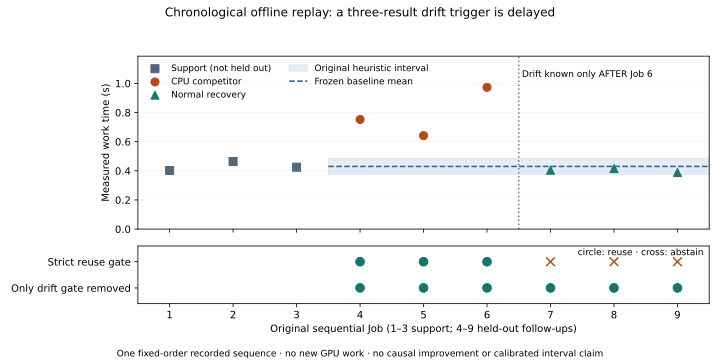

# S5: what the recorded drift gate actually changes

This exploratory offline replay uses the published
[load-drift capture](load-drift.md), with an
[analysis definition](uncertainty-drift-ablation.md) and
[byte/content-bound plan](../evidence/uncertainty-drift-ablation-plan-v1.json)
frozen in `c7ba908` before replay calculation. Earlier outcomes were already
known; this is not a prospective hardware comparison. No GPU Job, deployment,
policy change, refitting or new measurement was performed.



## Paired decisions before each target

The first three normal Jobs support the original recommendation. All SIX later
Jobs are evaluation targets: three CPU-competitor Jobs, then three normal
recovery Jobs. The strict replay uses only assessments available before each
target was submitted. The target's own result is never used to decide whether
that same target can reuse the old recommendation. Removing ONLY the recorded
`CONSECUTIVE_RESIDUAL_DRIFT` reason leaves every other reason intact.

| Original Job | Condition | Strict reuse | Drift reason removed | Later elapsed work |
|---|---|---|---|---:|
| 4 | CPU competitor | Allowed | Allowed | 0.752331s |
| 5 | CPU competitor | Allowed | Allowed | 0.641712s |
| 6 | CPU competitor | Allowed | Allowed | 0.973122s |
| 7 | Normal recovery | Abstain | Allowed | 0.404479s |
| 8 | Normal recovery | Abstain | Allowed | 0.415888s |
| 9 | Normal recovery | Abstain | Allowed | 0.389228s |

Three decisions change; reuse coverage is3/6 versus6/6, a50-percentage-point
difference in this finite recorded cohort. Crucially, the three-result trigger
becomes known only AFTER Job6. Both policies therefore admit all three
CPU-competitor targets whose later absolute residual exceeds the original25%
threshold. The strict replay subsequently withholds three normal-recovery
targets whose outcomes lie inside the original heuristic interval.

**This capture does not demonstrate that the drift gate reduced forecast
errors.** The gate is a delayed, latched requalification rule, not an early
congestion predictor. It refuses to revive an old approval after apparent
recovery; the [actual trial](load-drift.md) separately verified that old-approval
submission was rejected. The offline masks are not additional actual approvals,
prevented executions, prevented failures or measured resource savings.

## Error and coverage, with denominators retained

The frozen baseline mean is0.430207s; its original heuristic interval is
[0.375981,0.484434]s. On ALL six held-out targets, interval inclusion is3/6,
mean absolute relative error is25.317%, and three forecast residuals exceed25%.
All measured numerical-quality and peak-memory gates pass.

For the strict policy's accepted subset, interval inclusion is0/3 and mean
absolute relative error is43.856%. For the ablated policy's larger accepted
subset they are3/6 and25.317%. These subset metrics have different denominators:
the lower ablated average does not prove a better policy. Report the raw paired
decision masks alongside them. Forecast exceedance is also not proof of a wrong
resource configuration; this capture tests one qualified configuration and
does not measure alternative-candidate regret.

| Phase | n | Mean work time | Sample SD | Median | Missing |
|---|---:|---:|---:|---:|---:|
| Normal support | 3 | 0.430207s | 0.031308s | 0.424707s | 0 |
| CPU competitor | 3 | 0.789055s | 0.168730s | 0.752331s | 0 |
| Normal recovery | 3 | 0.403198s | 0.013376s | 0.404479s | 0 |

The independent unit is the original scheduler Job; twelve within-Job blocks
are subsamples. This one fixed-order workload/device sequence is confounded
with time, so no significance test, population interval, causal superiority
or generalization claim is made. The original mean±3 standard-error bounds
are not calibrated future-Job prediction intervals. The separate
[confirmation-overlap ablation](uncertainty-ablation.md) keeps its own nine-study
denominator; the two cohorts/gates are not pooled.

## Reproduce and inspect

[Full JSON](../evidence/uncertainty-drift-ablation-v1.json) includes source digest,
support and target IDs, assessment timestamps, all available prior evidence,
remaining reasons, raw values, paired masks and original costs. The
[evaluator](../../examples/evaluate_uncertainty_drift_ablation.py) runs the complete
existing load-drift auditor, reconstructs the original interval, and checks
chronology/policy/identity and frozen source bytes before replay. Invalid
quality/memory, future/current target leakage, changed support, forecast
intervals or omitted costs are rejected.

```sh
uv run python examples/evaluate_uncertainty_drift_ablation.py \
  --capture docs/evidence/load-drift-v1.json \
  --plan docs/evidence/uncertainty-drift-ablation-plan-v1.json \
  --output /tmp/new-drift-ablation.json
uv run --no-project --with matplotlib==3.10.7 python \
  examples/plot_uncertainty_drift_ablation.py \
  --report /tmp/new-drift-ablation.json --output /tmp/new-drift-ablation-figure
```

The analysis/figure refuse to overwrite outputs. SVG and PNG were generated; the PNG rendering was visually inspected. Twenty-four focused replay/source-audit tests pass,
including adversarial chronology, current-target leakage, unchanged input,
non-drift reasons, quality/memory and plan-byte checks. Tests are not additional
hardware experiments. All197 original GPU reservation seconds remain charged
to the original qualification/observations; this replay adds zero and reports
no savings. Full fleet effectiveness, unseen-family calibration, other
uncertainty reasons and the remaining Slurm/Pi/full-HAIRP gates stay open.
