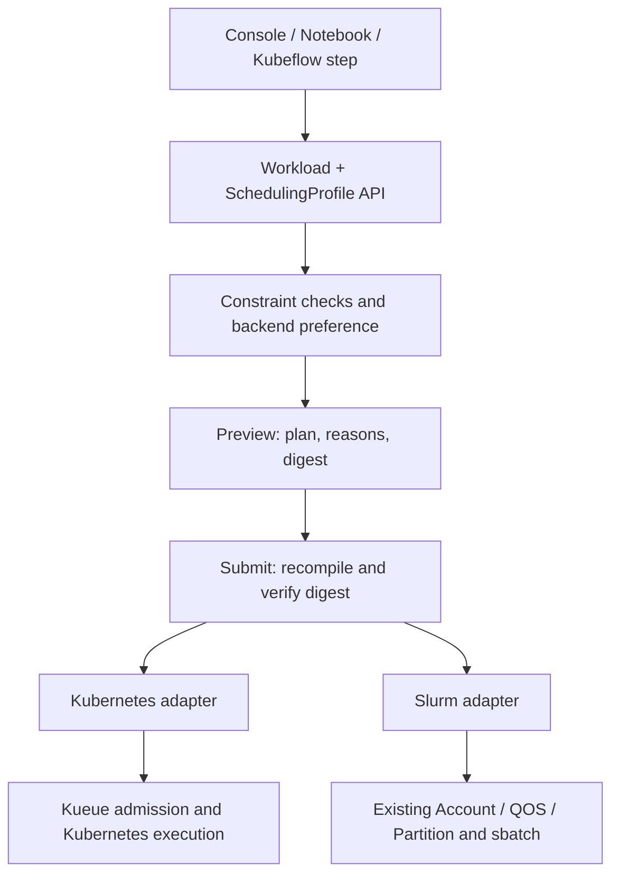

# Common scheduling profiles

The platform compiles a versioned `SchedulingProfile` into a job-specific plan.
It retains the existing execution adapters and KubeEdge runtime.

## Responsibilities and boundaries

- A workload defines executable code, validated runtime variants and compatible
  device candidates. A saved job template can narrow it to one candidate.
- A profile defines allowed workload/allocation types, resource ceilings,
  normal/high priority, maximum run/queue times and backend preference order.
- Bindings map each backend/cluster to administrator-provisioned LocalQueue /
  WorkloadPriorityClass or Account / QOS / Partition. These names must match the
  worker route. Changing a profile never edits `slurm.conf` or provisions queues.
- The compiler filters workload candidates, then orders by backend preference and
  candidate reference. This initial deterministic policy does **not** predict
  performance, inspect current free capacity, migrate running jobs or replace
  the Placement Engine. A preview is not an admission or resource reservation.
- Priority is a backend-local mapping; it does not promise equal priority across
  schedulers, immediate execution, or Kubernetes Pod priority/preemption.
- Quota remains backend-local. Global atomic quota and preemption overrides are
  rejected explicitly. Slurm training remains unsupported by the existing
  training-isolation guard. Profiles currently apply to ordinary observe jobs.
- Run/queue limits are the minimum of workload/template and profile limits;
  profile priority takes precedence. Worker timeout and native execution limits
  follow the resulting immutable job specification.
- Every submission recompiles and verifies the preview digest. The job saves the
  complete plan. Each native adapter compares actual route bindings with the
  saved plan and fails with `SCHEDULING_BINDING_DRIFT` if settings changed.
  Existing requests without profiles retain their original behavior.

## API and console

All endpoints use `/api/v1/compute`. Ordinary project users can preview and
submit. Only operators can register profiles. Profiles are immutable; changes
require a new reference/version. Project access is enforced server-side.

1. Operator: `POST /scheduling-profiles` using a profile such as
   [`examples/scheduling-profile.json`](../examples/scheduling-profile.json).
   Replace the example bindings with existing worker-route settings.
2. User: `POST /scheduling-plans` with
   `{"profile_ref":"interactive-v1","workload_ref":"registered-workload"}`.
   Optionally include `candidate_ref`, `template_ref` or `backend`.
3. An accepted response contains `plan` and `digest`. Submit `POST /jobs` with
   `workload_ref`, the returned `candidate_ref`, `mode:"observe"`,
   `scheduling_profile_ref`, and `scheduling_plan_digest`. Use an
   `Idempotency-Key` header. A template preview also requires `template_ref` in
   the submission. Rejected previews include common and per-candidate reasons.
4. In the console, choose a workload and a common scheduling profile, leave the
   device blank for policy selection or choose a device, click **정책 적용
   미리보기**, inspect the queue/QOS and limits, then **작업 제출**.
   Job details retain **적용한 SchedulingProfile**.

The same API can be called inside an existing Notebook or Kubeflow component;
this change does not add another workflow engine or automatically rewrite
existing Kubeflow pipelines.

## Device execution coverage

`examples/build_cuda_target.py` converts an actual successful
`cuda_probe.py --qualify` report into a device-specific registered workload.
The probe executes a CUDA integer square kernel, checks all 4096 outputs and
measures 10 synchronized launches after 2 warmups. It never falls back to CPU.
The image must be pinned and match the host CPU architecture. Per-route
`runtime_class_name` is supported where the GPU runtime is not the default.

This is a GPU execution smoke workload, **not a CNN/transformer benchmark**.
Memory describes the 16 KiB output allocation, not total context/device peak
memory. Power, temperature and utilization remain unmeasured. Existing schema
`MODEL_VERIFIED` means this numerical workload's correctness check; it is not
an AI-model accuracy qualification. Shared slots remain distinct from physical
GPUs and are not claimed as isolated devices. NPU models require their own
vendor runtime and compiled model; discovery alone does not make them runnable.

## Verification

Focused tests cover policy rejection, project/operator access, immutable
profiles, preview/submission consistency, native Kubernetes and Slurm mapping,
route drift, idempotency and CUDA result serialization. Hardware reports and
private binding configuration are kept outside the public repository.

Native semantics: [Kueue concepts](https://kueue.sigs.k8s.io/docs/concepts/) and
[Slurm QOS](https://slurm.schedmd.com/qos.html).

## Recorded lab rollout (2026-10-06)

The common policy path was deployed to the API and both workers. Four separate
Kubernetes jobs using the normal profile completed on RTX 5060 Ti, NVIDIA GB10
(Spark), Jetson Orin Nano and Jetson AGX Orin. All used real CUDA execution;
this confirms the submission/result path, not comparative AI-model performance.
A separate existing Hailo ResNet50 workload also completed.

Current catalog workloads are device-specific (one candidate each). The backend
preference therefore does not manufacture an alternative executable. Selection
between two compatible backend candidates is covered by a contract fixture;
a real equivalent-workload comparison across both backends remains future work.
Vendor NPUs without a validated compiled-model workload remain unavailable for
submission. Dedicated lab queues and RuntimeClass settings are privately
provisioned; they have not been converted into a portable GitOps lab overlay.

The browser-submitted Slurm Orin CNN job also completed through the same profile
preview and digest-checked submission API, using the existing Account/QOS route.
