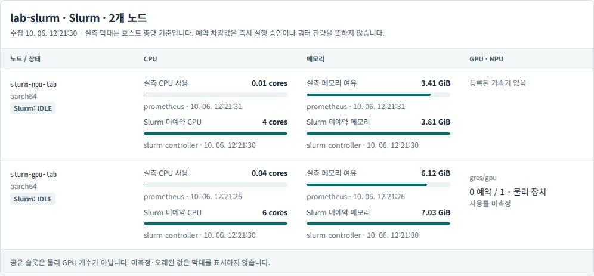
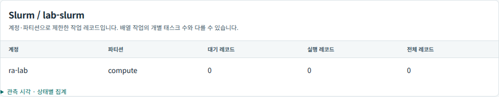

# Real Slurm queue/resource observations and restricted SSH

The [fixed controller trial](slurm-controller-plan.md) passed against the actual
Slurm 24.11.5 lab on October 6. Two Jobs were submitted, one canceled while
pending, and the holder completed its 4,096-element CUDA check. This is a
controller/transport acceptance, not an additional model qualification.

| Observation | Idle before | Holder + waiter | Idle after |
|---|---:|---:|---:|
| Running records | 0 | 1 | 0 |
| Pending records | 0 | 1 | 0 |
| GPU allocation | 0 | 1 | 0 |
| GPU reservation headroom | 1 | 0 | 1 |
| GPU worker state | IDLE | MIXED | IDLE |

The actual wait reason was **`AssocGrpCpuLimit`**, reflecting the unchanged account
CPU quota. Do not relabel it GPU exhaustion merely because GPU headroom was also
zero. The holder recorded 31 GPU reservation seconds; the waiter had no start,
allocation or output and was canceled before execution. Holding an allocation
during a deliberate 30-second sleep is not evidence of GPU utilization. The
[raw sanitized snapshots, accounting and logs](evidence/slurm-controller-v1.json)
retain these distinctions and missing step MaxRSS.

The Pi remained IDLE and exposed CPU/memory resources with no registered GRES.
Its public node alias includes `npu`, but neither that alias nor CPU readiness
means the absent DEEPX hardware is usable.

## Source-contract fixes

The initial real idle response included a successful empty-list warning that the
old collector rejected. It also supplied `gres_used=gpu:orin_nano:0(IDX:N/A)` while
omitting zero GPU usage from `tres_used`. The corrected collector recognizes those
explicit observations, never fills missing/ambiguous allocation with zero, and
requires the exact qualified controller release and parser. `gres_drained=N/A`
is the pinned implementation's unimplemented per-GRES drain report; node-level
DRAIN/DOWN flags remain separate blockers. The
[plan links the installed-version source definitions](slurm-controller-plan.md).

Software tests cover nonempty/foreign/error responses disguised by the empty
warning, unknown releases, missing counts, duplicate typed resources, aggregate
plus typed double-counting, and retained node drain flags. These fixtures remain
separate from the actual scheduler snapshots.

## Dedicated observation credentials

The [restricted observer](slurm-observer-transport.md) is now provisioned on the
controller by the separate Ansible play. Six tasks changed on first apply and
zero changed on repeat. The authorization-negative preflight changed zero tasks.
An initial check lacked inherited private SSH variables and failed authentication
before any remote mutation; the corrected check passed. An earlier local YAML
syntax error was corrected before any apply.

Using only the new key, strict verification against the already trusted host key
and no operator password:

- The two allowed node/queue commands returned live data.
- Submit-client, cancel-client, shell and foreign-account requests each returned
  exit 1, no stdout and the forced command's rejection message. The negative
  submit/cancel requests used version/help arguments and created/canceled no Job.
- The actual collector consumed both responses successfully through this identity.
- Only allowed node names and required fields passed the transport; addresses,
  private annotations, job commands and user metadata were removed.

Controller/DBD/SSH process IDs, protected configuration hashes and boot identity
were unchanged. Both worker configurations and daemon state, existing Slurm
QOS/associations, driver hashes, node inventory and the empty queue were also
unchanged by provisioning. No scheduler association or sudo privilege was given
to the observer, and no shared operator credential enters the collector.

## Continuous collector and console acceptance

**Continuous controller observations are now deployed.** Only the optional
inventory Argo Application was updated, at revision
`99810ec04ed148353a0dbf92cd8f54c066538318`, with pruning disabled. Argo reported
Synced/Healthy and the operation succeeded. The final image digest is
`sha256:854df77b194f5f9244f57212a5d8c82c9ab3557d3081d527afeb26cad7a67af2`.

The [image/mount procedure](slurm-observer-transport.md#collector-image-and-credential-mount)
adds the qualified SSH payload to the existing locked Python runtime. Signed
Debian package version `1:10.0p1-7+deb13u4` reports
`OpenSSH_10.0p2 Debian-7+deb13u4`; both values and all ten dependency archive hashes
are retained. The acceptance Pod ran with UID 10001, read-only root and no service
account token. It read actual node/queue data with the dedicated key, retained all
eight Prometheus metrics, and rejected shell/submit/cancel requests. The deployed
collector's source hash matched the accepted source.

Two distinct PostgreSQL/API snapshots advanced from 03:20:29 to 03:21:00 UTC on
October 6. Each showed two IDLE nodes, an empty scoped queue and GPU capacity 1,
allocation 0, reservation headroom 1. Anonymous access returned 401, another
project returned 404 and its overview excluded the Slurm pool. The existing
Kubernetes pool retained ten nodes. All six preexisting service Pods retained
their identities, containers and restart counts, including API, worker and DB.

Actual browser checks used a loopback, read-only authenticated proxy to the live
TLS-verified API; no synthetic scheduler data or credentials entered the browser.
The resource panel shows measured host bars separately from scheduler reservation
headroom, and the queue panel shows scoped record counts. GPU utilization remains
**unmeasured**; the Pi correctly shows no registered accelerator.

[Sanitized delivery evidence](evidence/slurm-controller-continuous-v1.json) retains
image/source/package provenance, API snapshots, authorization checks and failures.
Initial apt cache permissions were corrected inside the disposable build Pod;
an inherited `local` transport setting was rejected before SSH and corrected to
`ssh`. An initial browser request encountered an old port-forward's missing
sandbox; its existing systemd retry reconnected without restarting the API.
No Slurm Job was submitted by this rollout or its acceptance checks.

The implementation's [CI run](https://github.com/dsa04156/resource-advisor/actions/runs/37408214255)
passed Python 3.11/3.13 contracts, wheel/assets, lint and Ansible syntax. Both
versions passed 894 tests with two DB tests skipped without a database, then all
896 tests with PostgreSQL. The affected local suite passed 70 tests.

A subsequent [isolated Jetson runtime](slurm-jetson-runtime-results.md) passes its
fixed GPU CNN gate without changing drivers or promoting the earlier failed
PyTorch candidate. The complete Slurm API→model→artifact/usage path remains open.
