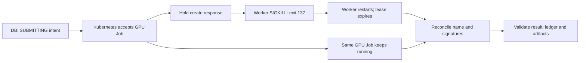

# Supervised worker and accepted-submit crash recovery

The Kubernetes worker now runs continuously as an independent Deployment with a
project namespace Role and projected ServiceAccount. The live image includes
hash-locked artifact delivery plus **PyTorch 2.8.0+cpu / BoTorch 0.16.1** for control
and optimization. Compute Jobs still use their own qualified **CUDA 12.8 /
PyTorch 2.8.0+cu128** runtime and Kueue admission. The controller requests no GPU.

## Verified failure boundary

The difficult case is an accepted scheduler submission whose acknowledgement
was not committed to the database. A restart must discover that Job, not submit
another one. This test killed the actual worker process at that boundary.



A freshly qualified [recovery workload](../examples/recovery_workload.py)
initialized a CUDA context and waited **30 seconds before matmul measurement**.
This allowed controlled interruption while its GPU allocation/container remained
live. It is not 30 seconds of useful GPU work or benchmark latency. Numerical
matmul agreement is benchmark correctness, not trained-model accuracy.

The [qualification-only kubectl shim](../examples/hold_submit_response.py)
forwarded the exact attempt's Job creation, counted the invocation and held the
successful response. At interruption the database still had `SUBMITTING` and
**no external ID**. The test worker Pod temporarily shared its PID namespace so
the Python worker was not protected PID 1; an operator exec killed only that
worker with SIGKILL. Container status recorded **exit 137 and one restart**.
The compute ran in a separate Pod and process namespace and was never killed.

## Actual result

[Raw sanitized evidence](evidence/worker-recovery.json) records real identifiers,
server times, metrics, image digest and event counts:

| Check | Observed result |
|---|---|
| Physical compute | NVIDIA GeForce RTX 5080, one GPU |
| Actual Job create invocations | **1** |
| Submit outbox claims | **2**, both referring to the same attempt |
| GPU Job / Pod | Same Job UID and same sole compute Pod UID throughout |
| Final application state | `SUCCEEDED` |
| Numerical quality | 1.0, 20 measured work units |
| API idempotent replay | Original application Job returned |
| Usage ledger | One record, 32 observed physical GPU allocation seconds |
| MLflow | One FINISHED run; artifact bytes matched API/S3 result bundle |
| Delivery events | Submit, artifact, MLflow and MLflow-artifact all DONE |

The existing **120-second submission lease** delayed reclaim after the crash.
Deployment/startup through result observation took **160.19 seconds** in this
trial. That includes startup and lease waiting and is not pure restart latency,
queue service time or a promised recovery SLO. GPU utilization, power and
temperature were not attributed to this short run and remain null.

The response shim, its ConfigMaps and process-namespace override were removed
after evidence capture. The normal worker was rolled out again and is available
with one replica and no fault injection. No original cluster version, node
pressure protection, driver or GPU state was reset.

## Reproduce deployment

[`deploy/worker`](../deploy/worker) is separate from the API/inventory base. It
defaults to **zero replicas** until an operator supplies qualified routes and a
digest-pinned image. The private site overlay selects the approved standard
kubelet server pool, image, and one replica. Apply only to the independent lab
namespace; changing the namespace also requires matching ServiceAccount bindings.

```sh
python examples/build_launcher.py \
  --base '<qualified Python 3.11 amd64 image>@sha256:<digest>' \
  --destination '<authorized registry>/resource-advisor/worker:<version>' \
  --workdir /scratch/new-worker-build \
  --extra artifacts --extra optimizer \
  --kubectl /secure/path/verified-kubectl \
  --kubectl-sha256 '<official version-specific SHA-256>'
kubectl apply --dry-run=server -k /secure/path/worker-site
kubectl apply -k /secure/path/worker-site
kubectl -n resource-advisor-lab rollout status deployment/ra-worker --timeout=60s
```

Required Secrets:

- `ra-service-db/url`: the restricted application DB URL using service DNS.
- `ra-artifact-client`: dedicated object-store credentials, as in
  [service deployment](service-deployment.md).
- `ra-worker-config/worker.json`: operator-controlled project/cluster routes,
  explicit namespace/LocalQueue/node selectors, verified runtime bundles,
  optional qualified training input bindings, artifact bucket mapping and
  project-to-MLflow experiment mapping. Kubernetes routes set `kubeconfig: null`
  to use the projected token. No administrator kubeconfig is mounted.

The Role permits Job create/read/delete and Pod/log reads only in the project
namespace. Live checks denied direct Secret reads, node listing and Job creation
in another namespace. Job creation is still a trusted permission: namespace RBAC
alone does not stop a compromised controller from constructing Pods that mount
namespace Secrets. This is not proof of hostile multi-tenant isolation.

Recreate deployment and one replica avoid intentional controller overlap in this
lab. Do not scale this into a highly available or project-sharded control plane
without separate leader/concurrent-worker/fencing qualification. Outbox leases
are not a global distributed leader election mechanism.

## Repeat the recovery experiment

1. Require no other active jobs/studies in the test database. Qualify the CUDA
   runtime and immutable source ConfigMap, including the recovery fixture, on
   the authorized GPU through the existing queue. Retain output and signatures.
2. Register fresh capability/variant/workload records with the preparation wait
   in their code/config identity. Submit an observe request while the worker is
   at zero replicas, recording its exact application Job and attempt IDs.
3. In a **test-only** overlay, set `shareProcessNamespace: true`; mount the shim
   as executable `/fault/kubectl`, prepend `/fault` to PATH and set
   `RA_RECOVERY_ATTEMPT` to that exact attempt. The genuine verified kubectl
   remains `/usr/local/bin/kubectl`. Enable one worker replica.
4. Observe `/tmp/accepted-submit.json`, the compute Pod's preparation marker,
   and persisted `SUBMITTING`/missing external ID before the normal 30-second
   command timeout. Kill the unique Python worker PID **greater than 1**, never
   the compute process or a node. Capture the container's exit 137/restart count.
5. Wait on that same attempt and its normal lease; do not resubmit or manually
   reset the lease. Verify one create counter line, original Job/Pod UIDs, a
   valid hardware result, one ledger row, one MLflow run and matching artifacts.
6. Remove the fault mount/env/process-namespace override, roll out the normal
   worker, then delete only the test ConfigMaps. Retain compute evidence.

If the preparation/acceptance boundary is not observed, record an invalid test
attempt; do not report a process crash or silently create replacement work.
This trial proves one Kubernetes submission-response crash boundary. Slurm
crash recovery, node disconnection, concurrent workers, cancellation crashes and
an optimization loop interrupted between suggestions remain distinct open gates.

The worker also handles SIGTERM after completing its current cycle and writes
readiness only after that cycle. A hung cycle becomes unready without automatic
dependency-driven killing. SQLite/PostgreSQL suites each passed **194** tests.

Reference: [Kubernetes shared process namespace and PID 1 semantics](https://kubernetes.io/docs/tasks/configure-pod-container/share-process-namespace/).
